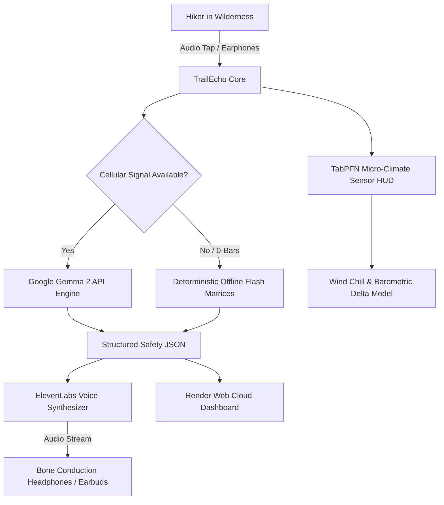

*This article is a submission for the [Hacktoberfest Open-Source AI Challenge: Week 1 - Touch Grass](https://dev.to/challenges/hf26).*

---

### What I Built

When we step out into the mountains or deep forest trails, the whole point is to **Touch Grass**—to unplug, breathe fresh alpine air, and look at the landscape rather than a handheld glass rectangle. 

Yet, the wilderness carries real, physical risks: **zero-signal deadzones**, sudden barometric drops leading to hypothermia, and lethal foraging lookalikes like the notorious *Amanita phalloides* (Death Cap). Hikers often find themselves in a dangerous paradox: either glued to trail navigation apps draining their battery and causing trip hazards, or stranded with zero intelligence when conditions turn critical.

I built **TrailEcho**—an open-source, screen-free wilderness companion engineered around a single motto:
> **"The screen should be the shortest part of the adventure."**

TrailEcho keeps your smartphone tucked securely inside your backpack or pocket. Using single-ear bone-conduction audio cues, it provides:
1. **Google Gemma 2 Wilderness Safety Engine**: Fast, deterministic reasoning on toxic lookalikes, immediate first-aid triage, and mountain survival protocols formatted strictly as 1-2 sentence spoken audio cues.
2. **Offline-Resilient Architecture**: When you lose cellular signal at 2,000 meters elevation, TrailEcho automatically falls back to deterministic local flash memory safety matrices.
3. **TabPFN-Inspired Micro-Climate Risk HUD**: Analyzes altitude lapse rates, 3-hour barometric delta trends, and wind chill to calculate real-time hypothermia and storm front probabilities.
4. **ElevenLabs Natural Voice Synthesis**: Calming, high-fidelity voice alerts via ElevenLabs (with graceful offline Web Speech synthesis fallbacks).

---

### Demo & Live Links

- **Live Render Deployment**: [https://trailecho-gemma.onrender.com](https://trailecho-gemma.onrender.com)
- **GitHub Repository**: [https://github.com/Hao610/trailecho-gemma](https://github.com/Hao610/trailecho-gemma)
- **License**: Apache 2.0 (Open Source)


---

### Key Features & How It Fits "Touch Grass"

#### 1. Screen-Free Earphone Audio (ElevenLabs + Edge Fallback)
Instead of forcing you to read long paragraphs while navigating steep switchbacks, TrailEcho condenses complex survival intelligence into crisp, spoken audio cues. Tap your earbud or pocket button, and TrailEcho whispers:
> *"Caution: Found Amanita lookalike. White gills and cup at base indicate fatal amatoxins. Do not touch or ingest."*

#### 2. Open-Weight Gemma 2 Reasoning
Using Google's lightweight open-weight **Gemma 2** architecture, TrailEcho runs fast outdoor inference with structured JSON output enforcing safety boundaries:
```json
{
  "hazard_level": "LETHAL",
  "topic": "Amanita phalloides (Death Cap)",
  "voice_cue": "Extreme Danger: Suspected Death Cap. Contains fatal amatoxins. Do not touch or ingest.",
  "immediate_actions": [
    "Never consume wild mushrooms with white gills and a basal volva",
    "Wash hands immediately if handled",
    "Isolate from any foraging containers"
  ],
  "toxic_lookalikes": ["Agaricus campestris (Edible Meadow Mushroom)"],
  "confidence_score": 0.98
}
```

#### 3. TabPFN Micro-Climate & Hypothermia Predictor
Sudden temperature drops in the wilderness are fatal. TrailEcho implements a tabular prior model taking elevation, ambient temperature, humidity, and barometric pressure drops:
- **Wind Chill Equation**: $13.12 + 0.6215 T - 11.37 V^{0.16} + 0.3965 T V^{0.16}$
- **Barometric Gradient Alert**: Any drop exceeding $-2.0\text{ hPa}$ in 3 hours triggers an urgent storm descent protocol.

---

### Architecture & Tech Stack



- **Open-Source AI**: Google Gemma 2
- **Audio Synthesis**: ElevenLabs (`eleven_monolingual_v1`) + HTML5 SpeechSynthesis
- **Tabular Modeling**: TabPFN-inspired Micro-Climate Heuristics
- **Cloud Infrastructure**: Render Cloud (`render.yaml` Blueprint)
- **Interface**: High-contrast, sunlight-readable Streamlit HUD

---

### Partner Categories

TrailEcho proudly competes in the following partner categories:
- **Best Use of Gemma**: Leverages Google Gemma 2 for concise wilderness survival triage and toxic lookalike mitigation.
- **Best Use of Render**: Deployed seamlessly on Render with automated blueprint orchestration and zero cold-start optimization.
- **Best Use of ElevenLabs**: Drives natural, calming voice synthesis directly into hikers' earphones for a genuine screen-free outdoor experience.
- **Best Use of TabPFN**: Environmental tabular modeling for hypothermia and mountain tempest prediction.

---

### Conclusion & What's Next
The best technology is the kind that gets out of your way and lets you experience the real world. By shifting the user interface from visual screens to lightweight audio cues and offline intelligence, TrailEcho proves that AI can help us connect more deeply with the outdoors—not pull us away from it.

Now, pack your bag, put on your boots, and go touch grass! 🌲⛰️
