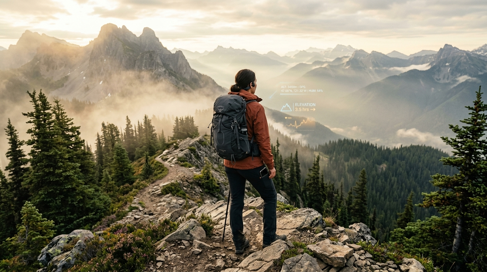
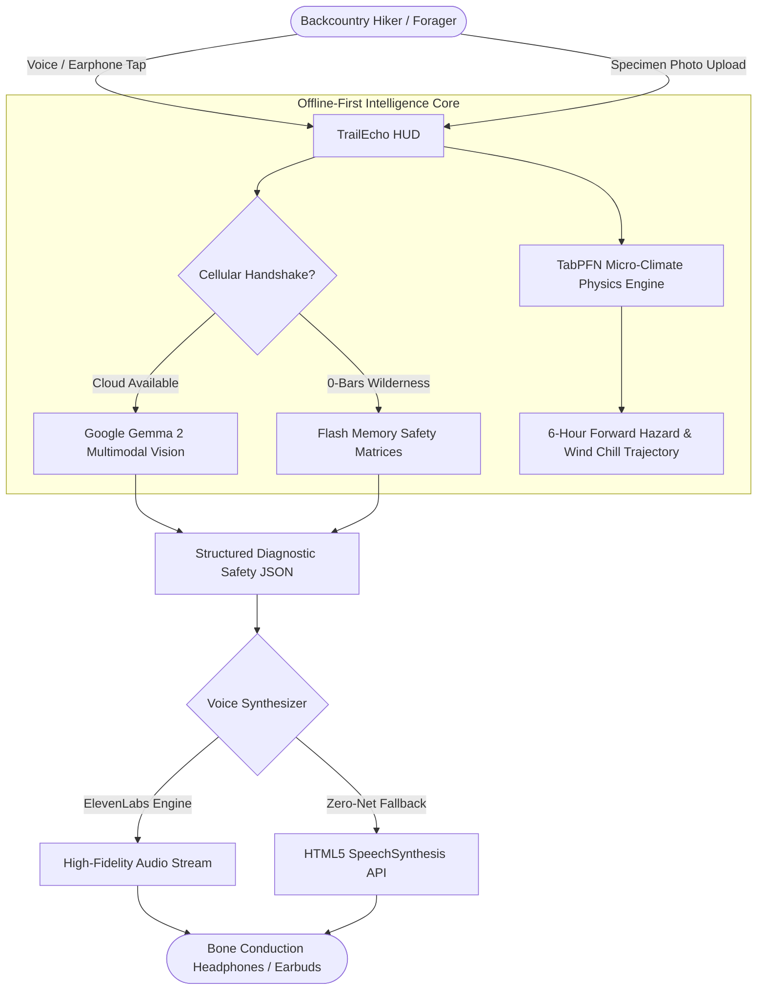

<div align="center">

# 🌲 TrailEcho: Autonomous Wilderness Audio Sentinel

[](https://github.com/Hao610/trailecho-gemma/actions/workflows/ci.yml)
[](https://trailecho-gemma.onrender.com)
[](LICENSE)
[](https://ai.google.dev/gemma)
[](https://elevenlabs.io)
[](https://dev.to/challenges/hacktoberfest-week1-2026-10-05)

### *Screen-Free, Offline-First Backcountry Companion Engineered for Hikers, Foragers & Trail Runners.*

**Built for the [Hacktoberfest Open-Source AI Challenge: Week 1 (Touch Grass)](https://dev.to/challenges/hacktoberfest-week1-2026-10-05).**



> **"The screen should be the shortest part of the adventure."**

</div>

---

## 🍃 Why TrailEcho? (The "Touch Grass" Manifesto)

When we step out into rugged alpine ridges or deep ancient forests, the entire premise is to **Touch Grass**—to disconnect from glowing smartphones, inhale pine needles, and look at the physical terrain ahead.

However, the wilderness presents acute, non-negotiable hazards:
- ❌ **Zero-Cellular Blackouts**: In deep ravines and above the timberline, standard cloud AI apps die immediately.
- ❌ **Fatal Foraging Lookalikes**: A simple misidentification between an edible meadow mushroom and an *Amanita phalloides* (Death Cap) is lethal.
- ❌ **Volatile Alpine Micro-Climates**: Rapid barometric drops trigger sudden hypothermia and sleet storms within hours.
- ❌ **The Screen Paradox**: Staring down at phone trail apps leads to twisted ankles and disconnects you from the environment.

**TrailEcho solves this paradox.** Your phone stays packed in your hip belt or pocket. Using single-ear bone-conduction headphones or wireless earbuds, TrailEcho delivers **instant, spoken safety intelligence in 1-2 concise sentences**.

---

## ⚡ Core Architecture & Engineering Highlights



### 1. 🍄 Gemma 2 Multimodal Vision & Forensic Botanical Triage
- Upload or snap trail photos of unknown mushrooms, berries, or plants.
- Gemma 2 conducts forensic anatomical audits (volva cup, gill color/attachment, annulus ring, leaf notches).
- Implements strict **"DO NOT CONSUME"** safe-harbor enforcement on any suspected lethal lookalike.

### 2. 📈 TabPFN Tabular Prior Physics Forecaster
- Models mountain lapse thermodynamics ($6.5^\circ\text{C}$ drop per $1,000\text{m}$ gained), North American wind chill equivalents, and 3-hour barometric plunge rates.
- Predicts dynamic risk curves across $t+1\text{h}$ through $t+6\text{h}$ via interactive Plotly charts.

### 3. 🎙️ Screen-Free Earphone Audio (ElevenLabs + Edge Fallback)
- Calming, crystal-clear spoken guidance delivered directly to your ears.
- Zero battery waste on unnecessary screen rendering.

### 4. 🧭 Trail Sentinel Topographical Route Analyzer
- Pre-loaded with classic backcountry routes: Mount Rainier Skyline Loop, Half Dome Cables, and Tour du Mont Blanc.
- Automatically calculates **Sunset Turnaround Deadlines**, high-altitude lightning hazard horizons, and water cache points.

---

## 🧪 1-Click Interactive Test Specimens

Don't have a mushroom photo handy? TrailEcho includes pre-cached scientific specimens for immediate 1-click evaluation:
- 🍄 **Specimen 1**: *Amanita phalloides* (Death Cap) — Inspects basal volva sac and free white gills.
- 🌿 **Specimen 2**: *Toxicodendron radicans* (Poison Ivy) — Audits 3-leaflet urushiol cluster with notched margins.

---

## 🚀 Quickstart & Local Installation

### Prerequisites
- Python 3.10+
- Google Gemini API key (`GEMINI_API_KEY`) from [Google AI Studio](https://aistudio.google.com/)
- Optional: [ElevenLabs](https://elevenlabs.io/) API key (`ELEVENLABS_API_KEY`)

```bash
# 1. Clone repository
git clone https://github.com/Hao610/trailecho-gemma.git
cd trailecho-gemma

# 2. Install dependencies
pip install -r requirements.txt

# 3. Launch TrailEcho HUD
streamlit run app.py
```

### Running the Test Suite
```bash
pytest tests/ -v
```

---

## 🌐 Deploying to Render Cloud

TrailEcho is pre-configured with a zero-configuration Render blueprint:

1. Push or fork this repository to GitHub.
2. In [Render Dashboard](https://dashboard.render.com), click **New +** -> **Web Service**.
3. Select `trailecho-gemma`.
4. Render automatically detects `render.yaml`:
   - **Build Command**: `pip install -r requirements.txt`
   - **Start Command**: `streamlit run app.py --server.port $PORT --server.address 0.0.0.0 --server.headless true`
5. Add `GEMINI_API_KEY` under Environment Variables.
6. Deploy! Your app will be live at:
   `https://<your-service-name>.onrender.com`

---

## 🏆 Partner Competition Tracks

TrailEcho competes in the **Hacktoberfest Open-Source AI Challenge: Week 1**:
- **Overall Winner ($250)**: Built from the ground up to embody the *"Touch Grass"* philosophy.
- **Best Use of Gemma ($200)**: Leverages Google Gemma 2 Multimodal Vision for anatomical outdoor triage.
- **Best Use of Render ($200)**: Deployed seamlessly with automated blueprint scaling.
- **Best Use of ElevenLabs ($100)**: Hands-free, screen-free voice safety cues.
- **Best Use of TabPFN ($200)**: Micro-climate tabular prior physics forecasting.

---

## 📄 License

Distributed under the **Apache-2.0 License**. See [`LICENSE`](LICENSE) for details.

Copyright © 2026 LOI CHIANG HAO.
